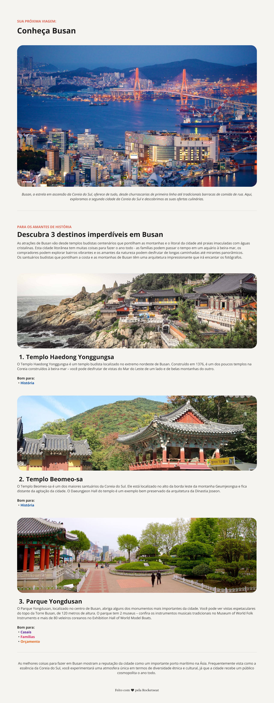

<h1 align="center"> Local Turístico </h1>

Projeto desenvolvido no curso Full Stack da Rocketseat.

  <a href="#-tecnologias">Tecnologias</a>&nbsp;&nbsp;&nbsp;|&nbsp;&nbsp;&nbsp;
  <a href="#-projeto">Projeto</a>&nbsp;&nbsp;&nbsp;|&nbsp;&nbsp;&nbsp;
  <a href="#-layout">Layout</a>&nbsp;&nbsp;&nbsp;|&nbsp;&nbsp;&nbsp;
  <a href="#memo-licença">Licença</a>

  

 

## 🚀 Tecnologias

Esse projeto foi desenvolvido com as seguintes tecnologias:

- HTML e CSS
- Git e Github
- Figma

## 💻 Projeto

O projeto local turístico é uma página de divulgação de um local turístico proposta como desafio dentro do curso Full Stack da Rocketseat.

Nele pude iniciar um projeto em HTML e CSS do zero até a entrega e aprimorar os conhecimentos adquiridos no decorrer do curso.

## 🔖 Layout

Você pode visualizar o layout do projeto através [DESSE LINK](<https://www.figma.com/design/8Kt3aUF0elQRIqojzYpKyL/Local-Tur%C3%ADstico-(Community)?m=auto&t=9dV5ZrMBbcWmAQw2-6>). É necessário ter conta no [Figma](https://figma.com) para acessá-lo.

## :memo: Licença

Esse projeto está sob a licença MIT.

---
